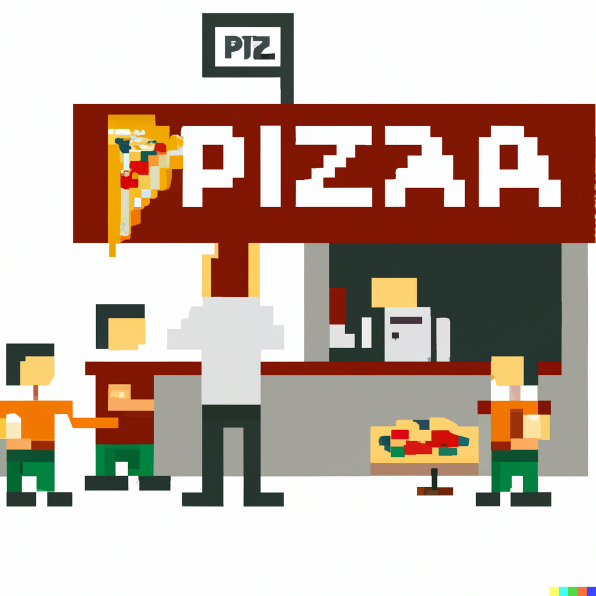

# PIZZA PARLOR

## Introduction
This was a two day sprint group project to practice React and Redux. We had a wireframe to follow to setup a simple app for a Pizza Parlor to allow customers to add pizzas to a cart, enter their info and place an order, as well as an admin page for tracking orders placed.
## Contents

This projects contains:

Components for:
PizzaMenu (loading as our home page)
CustomerForm (for entering customer information)
CheckoutPage (for reviewing order and customer info and submitting the order)
AdminTable (an admin page for reviewing orders placed)

To get started, simply:
Open terminal and run 'npm run server'
Open a second terminal and 'npm run client'

This will navigate you to the landing page!

If you'd like to checkout the admin page, navigate to /admin
## Authors

Team Pete Sam-wich had a great time working together and felt this was another great learning expereince as part the collaborative learning experience at Prime Digital Academy.

Our githubs and Linkedins are listed below.

Thanks again for checking out our project!

- Peter Ingles https://github.com/PeterIngles https://www.linkedin.com/in/peter-ingles/
- Sam Johnson https://github.com/sjohnamson https://www.likkedin.com/in/sam-johnson123/
- Samuel Nelson https://github.com/Samueltaneously https://www.linkedin.com/in/samuelhnelson/

